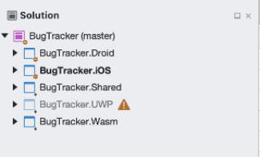

# Getting Started on Visual Studio For Mac

While it is easier to create apps using Uno on Windows, you can also create all but UWP apps on your Mac.

## Prerequisites
* [**Visual Studio for Mac 8.8**](https://visualstudio.microsoft.com/vs/mac/)
* [**Xcode**](https://apps.apple.com/us/app/xcode/id497799835?mt=12) 10.0 or higher
* An [**Apple ID**](https://support.apple.com/en-us/HT204316)
* **.NET Core SDK**
    * [.NET Core 3.1 SDK](https://dotnet.microsoft.com/download/dotnet-core/3.1) (**version 3.1.8 (SDK 3.1.402)** or later)
    * [.NET Core 5.0 SDK](https://dotnet.microsoft.com/download/dotnet-core/5.0) (**version 5.0 (SDK 5.0.100)** or later)
* [**GTK+3**](https://formulae.brew.sh/formula/gtk+3) for running the Skia/GTK projects

## Installing the dotnet new templates
- In order to create a new Uno Project, you'll need to install the [`dotnet new` Uno Platform templates](get-started-dotnet-new.md).
- Once done, in Visual Studio for Mac, open the preference menu:
  - On left side, open the **Other** then **Preview Features** menu
  - Check the **Show all .NET Core templates in the New Project dialog**

## Create a new project using the IDE
1. To create a new project:
    - Click the **New** button on the welcome screen
    - Select **Cross Platform App (Uno Platform)**
    - If presented with a list of options, uncheck **Skia/WPF**
    - Choose a name then click create

1. Once created, you should see your folder structure set up like this:
\
    - If you have a warning symbol on your iOS project, make sure you have the minimum version of Xcode installed.
\
To update, go to `Visual Studio > Preferences > Projects > SDK Locations > Apple` and select Xcode 12 or higher.
Restart Visual Studio.
1. If you did not get presented a list of options to create the project, as of Visual Studio for Mac 8.8, the Uno Platform template contains WPF projects that prevent NuGet restore to work properly. To fix this:
    - Select the `MyProject.Skia.Wpf` and `MyProject.Skia.Wpf.Host`
    - Right click to remove them from the solution.
    - At the top of the tree, on the solution node, right click and select **Restore Nuget Packages**
1. You can now run on iOS, Android, and macOS by setting your startup project and running.

   
Note: You will not be able to build the UWP and WPF projects on a Mac. All changes to this project must be made on Windows.

## Create a new project using the command line

You can create a new Uno Platfom solution with the following terminal command:
    ```bash
    dotnet new unoapp -o MyProject --skia-wpf=false
    ```
Once created, you can open it using the Visual Studio IDE.


### Build and Run for WebAssembly

Building for WebAssembly takes a few more steps:

1. Set `MyProject.Wasm` to startup project
2. Build the project
3. In the terminal, navigate to your build output. This will typically be: `MyProject.Wasm > bin > Debug > netstandard2.0 > dist > server.py` Run the `server.py` program.
4. In your browser, open localhost:8000. 

### Video Tutorial
[](http://www.youtube.com/watch?v=ESGJr6kHQg0 "")

### Getting Help

If you continue experiencing issues with Visual Studio and Uno Platform, please visit our [Discord](https://wwww.platform.uno/discord) - #uno-platform channel or [StackOverflow](https://stackoverflow.com/questions/tagged/uno-platform) where our engineering team and community will be able to help you. 
