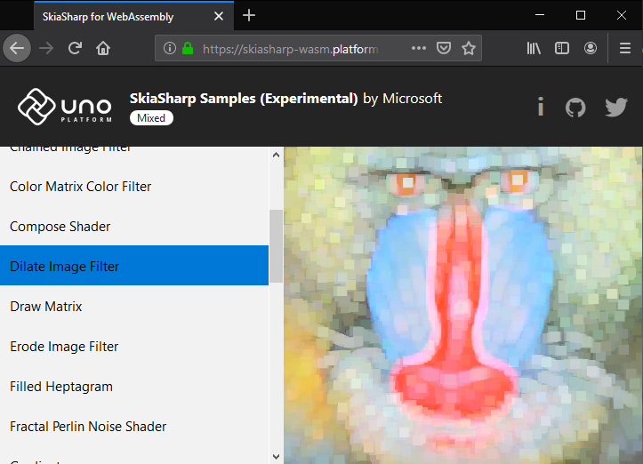

# SkiaSharp support for WebAssembly

[Skia](https://skia.org/) is pretty hot lately, and Uno Platform users have been asking for it for quite a while. It's now available through NuGet!

* You can view it in action here: [skiasharp-wasm.platform.uno](https://skiasharp-wasm.platform.uno)
* The NuGet packages are here: [nuget.org/packages/Uno.SkiaSharp.Views](https://www.nuget.org/packages/Uno.SkiaSharp.Views)

Mono has been providing support for Skia for a while through [SkiaSharp](https://github.com/mono/SkiaSharp), a .NET binding to the [Skia API that uses P/Invoke](https://github.com/mono/SkiaSharp/blob/master/binding/Binding/SkiaApi.cs#L96-L97) and a [custom Skia build](https://github.com/mono/skia) to provide the [C API to allow for the .NET interop](https://github.com/mono/skia/blob/xamarin-mobile-bindings/include/c/sk_canvas.h#L18).



## Adding SkiaSharp support for WebAssembly

We recently made experiments with CanvasKit, showing that it was possible to run the full SkiaSharp API on top of a custom interop layer, as Mono did not support proper WebAssembly dynamic linking. It was pretty slow, but it worked.

Dynamic linking is now fixed and it enabled the [Windows Calculator's calculation engine to be ported over to WebAssembly](https://platform.uno/a-piece-of-windows-10-is-now-running-on-webassembly-natively-on-ios-and-android/), and it also enables Skia to be compiled to WebAssembly and used through P/Invoke from .NET code.

To enable this, we're using a [fork of the Skia engine](https://github.com/unoplatform/skia) that adds support for both CanvasKit and SkiaSharp's C API, while disabling all the Javascript support. This is required as [double-based APIs are not exportable to JavaScript](https://github.com/emscripten-core/emscripten/commit/ccaf4e74fa9abf51cff8d1d4823f0b4d84bf3eab). This basically makes the Skia module look like a dll, as far as SkiaSharp is concerned.

Also, Mono supports static linking pretty well, and embedding the Skia engine directly in a Mono AOT-compiled WebAssembly application is available! This makes the [skiasharp-wasm.platform.uno](https://skiasharp-wasm.platform.uno) impressively responsive.

## The SKXamlCanvas Uno Control

We've also added support for the `SKXamlCanvas` control through the [`Uno.SkiaSharp.Views` package]([nuget.org/packages/Uno.SkiaSharp.Views](https://www.nuget.org/packages/Uno.SkiaSharp.Views)), which enables drawing using skia in a specific section of the XAML visual tree.

Here's what it looks like:

```xaml
    <Grid Background="{ThemeResource ApplicationPageBackgroundThemeBrush}">
      <skia:SKXamlCanvas x:Name="test" PaintSurface="OnPaintSurface" />
    </Grid>
```

And with some code behind:

```csharp
private void OnPaintSurface(object sender, SKPaintSurfaceEventArgs e)
{
    // the canvas and properties
    var canvas = e.Surface.Canvas;

    // get the screen density for scaling
    var display = DisplayInformation.GetForCurrentView();
    var scale = display.LogicalDpi / 96.0f;
    var scaledSize = new SKSize(e.Info.Width / scale, e.Info.Height / scale);

    // handle the device screen density
    canvas.Scale(scale);

    // make sure the canvas is blank
    canvas.Clear(SKColors.Yellow);

    // draw some text
    var paint = new SKPaint
    {
        Color = SKColors.Black,
        IsAntialias = true,
        Style = SKPaintStyle.Fill,
        TextAlign = SKTextAlign.Center,
        TextSize = 24
    };

    var coord = new SKPoint(
        scaledSize.Width / 2, 
        (scaledSize.Height + paint.TextSize) / 2);

    canvas.DrawText("SkiaSharp", coord, paint);
}
```

You can experiment with [this sample from our samples repository](https://github.com/nventive/Uno.Samples/tree/master/UI/SkiaSharpTest).

## The road ahead

There are still a few things we need to do for Skia support to be complete. 

**First**, we needed to fork SkiaSharp to enable WebAssembly support, because of the specificities of the native interop layer, noteable because [`Marshal.GetFunctionPointerForDelegate`](https://docs.microsoft.com/en-us/dotnet/api/system.runtime.interopservices.marshal.getfunctionpointerfordelegate?view=netframework-4.8) is not supported yet, and [emscripten's `addFunction`](https://emscripten.org/docs/porting/connecting_cpp_and_javascript/Interacting-with-code.html) function pointers feature [needs to be used](https://github.com/unoplatform/Uno.SkiaSharp/blob/uno/binding/SkiaSharp.Wasm/ts/SkiaSharpCanvasKit.ts#L21-L32) for the time being. 

We're [working with the SkiaSharp team](https://github.com/mono/SkiaSharp/issues/876) to add an adjustable interop layer that would enable WebAssembly support to be plugged-in at runtime, allowing proper support for packages such as [`SkiaSharp.Extended`](https://www.nuget.org/packages/SkiaSharp.Extended) to be used without being forked to be supported by WebAssembly.

**Second**, WebAssembly specifics in terms of function exports require a very specific set of pre-defined methods ([declared here](https://github.com/mono/mono/blob/8d80ccc897c678d7bdae645ca8629b0c5cc0b667/mono/mini/m2n-gen.cs#L30) in mono-wasm). Altering the existing Skia C API signatures to match those "known" methods is possible to some extent, but not for all methods. This is why some methods are still missing from the Skia implementation, and need to be adjusted to use structures instead of parameters, and avoid updating the Mono runtime to be supported.

**Finally**, we'll be adding support for the GL backend, as for now only software rendering is avaible. This will greatly improve the performance.

You can follow the progress with [this GitHub issue](https://github.com/unoplatform/uno/issues/1116).

Let us know what you think!

